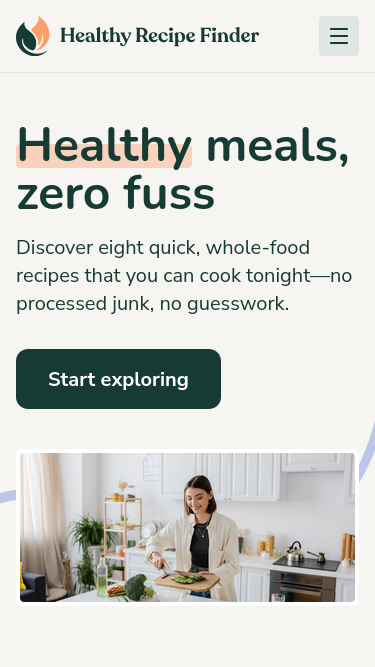
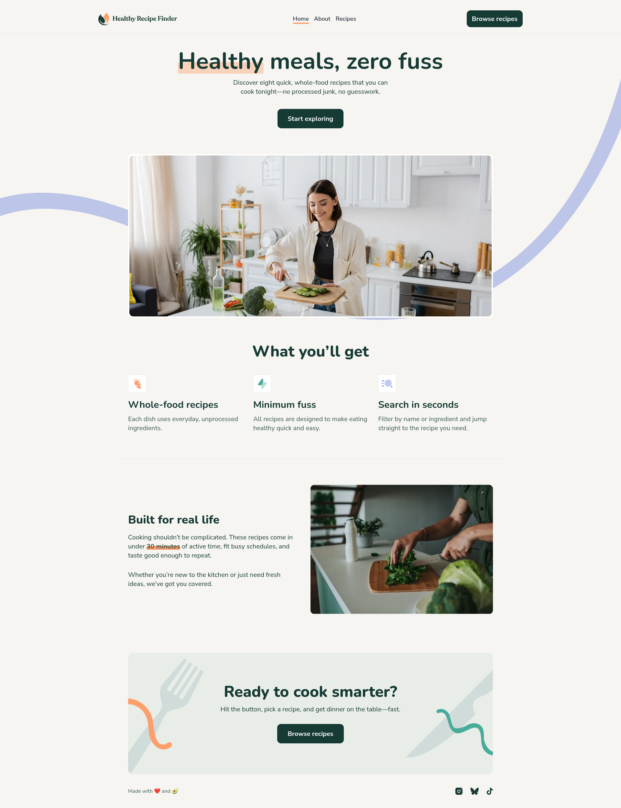

# Frontend Mentor - Recipe finder website solution

This is a solution to the [Recipe finder website challenge on Frontend Mentor](https://www.frontendmentor.io/challenges/recipe-finder-website--Ui-TZTPxN). Frontend Mentor challenges help you improve your coding skills by building realistic projects.

## Table of contents

- [Overview](#overview)
  - [The challenge](#the-challenge)
  - [Screenshot](#screenshot)
  - [Links](#links)
- [My process](#my-process)
  - [Built with](#built-with)
  - [What I learned](#what-i-learned)
  - [Continued development](#continued-development)
  - [Useful resources](#useful-resources)
- [Author](#author)
- [Daily Summaries](#daily-summaries)

## Overview

### The challenge

Users should be able to:

- View the home, about, recipes index, and recipe detail pages
- Search for recipes by name ~~or ingredient~~
- Filter recipes by max prep or cook time
- View the optimal layout for the interface depending on their device's screen size
- See hover and focus states for all interactive elements on the page

### Screenshot

### Links

- URL: [https://florianstancioiu.github.io/recipe-finder-website](https://florianstancioiu.github.io/recipe-finder-website)
- Frontend Mentor URL: [https://www.frontendmentor.io/solutions/recipe-finder-website-with-react-and-typescript-pYTOHgRSZw](https://www.frontendmentor.io/solutions/recipe-finder-website-with-react-and-typescript-pYTOHgRSZw)

## My process

### Built with

- Semantic HTML5 markup
- CSS custom properties
- Flexbox
- CSS Grid
- Mobile-first workflow
- [React](https://reactjs.org/) - JS library
- [TypeScript](https://www.typescriptlang.org/) - JavaScript with types
- [TailwindCSS](https://tailwindcss.com/) - For styles
- [Vite](https://vite.dev/) - Build tool

### What I learned

- I learned how to implement filters correctly - I used ChatGPT for that.
- I learned that I need to use the HashRouter in order for routes to work on Github Pages

### Continued development

- I would test the app using React Testing Library
- I would add Storybook to the project
- I would take my time to make the website more accessible to keyboard only users

### Useful resources

- [MDN - :focus-within](https://developer.mozilla.org/en-US/docs/Web/CSS/Reference/Selectors/:focus-within) - This helped me style the SearchInput component, more specifically I used it on the label that wrapped the input element

## Author

- Frontend Mentor - [@florianstancioiu](https://www.frontendmentor.io/profile/florianstancioiu)
- Threads - [@florianstancioiu01](https://www.threads.com/@florianstancioiu01)
- LinkedIn - [florianstancioiu](https://www.linkedin.com/in/florian-stancioiu-765661349/)
- freeCodeCamp - [florianstancioiu](https://www.freecodecamp.org/florianstancioiu)

## Daily Summaries

- **December 4th, 2025**: I created the repo, I added the following NPM packages: TailwindCSS, react-router and vite-plugin-svgr
- **December 7th, 2025**: I worked on the Header, HealthyMeals and WhatYouWillGet mobile components
- **December 8th, 2025**: I finished the mobile version of Home page, and I also completed the mobile version of About page
- **December 11th, 2025**: I worked on the `/recipes` mobile page and its components
- **December 12th, 2025**: I worked on the `/recipes/:slug` mobile page and its components
- **December 13th, 2025**: I worked on the tablet designs for `/` (home) and `/about` pages
- **December 16th, 2025**: I worked on the tablet designs for `/recipes` and `/recipes/:slug` pages and I also worked on the desktop version for `/` (home)
- **December 17th, 2025**: I worked on the desktop designs for `/about` and `/recipes` pages
- **December 18th, 2025**: I worked on the desktop design for `/recipes/:slug` page and I also worked on the RecipesFilter component
- **January 1st, 2026**: I worked on the active, hover and focus states of the components
- **March 21st, 2026**: I implemented the filter functionality in the `/recipes` route
