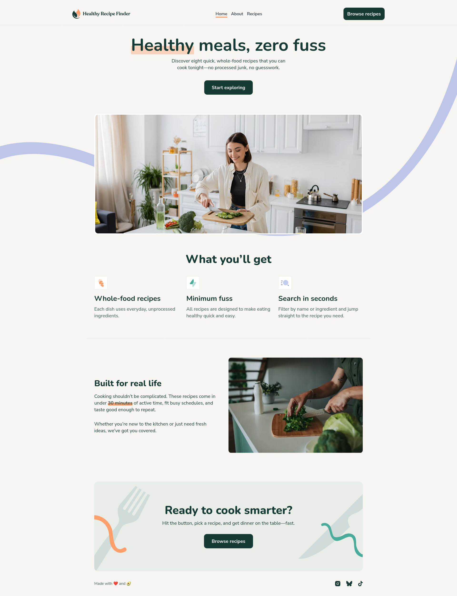

# Frontend Mentor - Recipe finder website solution

This is a solution to the [Recipe finder website challenge on Frontend Mentor](https://www.frontendmentor.io/challenges/recipe-finder-website--Ui-TZTPxN). Frontend Mentor challenges help you improve your coding skills by building realistic projects.

## Table of contents

- [Overview](#overview)
  - [The challenge](#the-challenge)
  - [Screenshot](#screenshot)
  - [Links](#links)
- [My process](#my-process)
  - [Built with](#built-with)
  - [What I learned](#what-i-learned)
  - [Continued development](#continued-development)
  - [Useful resources](#useful-resources)
- [Author](#author)

## Overview

### The challenge

Users should be able to:

- View the home, about, recipes index, and recipe detail pages
- Search for recipes by name ~~or ingredients~~ (I initially implemented the search by ingredients feature but if I leave it implemented the filter functionality seems incorrect to regular users)
- Filter recipes by max prep or cook time
- View the optimal layout for the interface depending on their device's screen size
- See hover and focus states for all interactive elements on the page

### Screenshot

### Links

- URL: [https://florianstancioiu.github.io/recipe-finder-website](https://florianstancioiu.github.io/recipe-finder-website)
- Frontend Mentor URL: [https://www.frontendmentor.io/solutions/recipe-finder-website-with-react-and-typescript-pYTOHgRSZw](https://www.frontendmentor.io/solutions/recipe-finder-website-with-react-and-typescript-pYTOHgRSZw)

## My process

### Built with

- Semantic HTML5 markup
- CSS custom properties
- Flexbox
- CSS Grid
- Mobile-first workflow
- [React](https://reactjs.org/) - JS library
- [TypeScript](https://www.typescriptlang.org/) - JavaScript with types
- [TailwindCSS](https://tailwindcss.com/) - For styles
- [Vite](https://vite.dev/) - Build tool

### What I learned

- I learned how to implement filters correctly - I used ChatGPT for that.
- I learned that I need to use the HashRouter in order for routes to work on Github Pages

### Continued development

- I would test the app using React Testing Library
- I would add Storybook to the project
- I would take my time to make the website more accessible to keyboard only users

### Useful resources

- [MDN - :focus-within](https://developer.mozilla.org/en-US/docs/Web/CSS/Reference/Selectors/:focus-within) - This helped me style the SearchInput component, more specifically I used it on the label that wrapped the input element

## Author

- Frontend Mentor - [@florianstancioiu](https://www.frontendmentor.io/profile/florianstancioiu)
- Threads - [@florianstancioiu01](https://www.threads.com/@florianstancioiu01)
- LinkedIn - [florianstancioiu](https://www.linkedin.com/in/florian-stancioiu-765661349/)
- freeCodeCamp - [florianstancioiu](https://www.freecodecamp.org/florianstancioiu)
